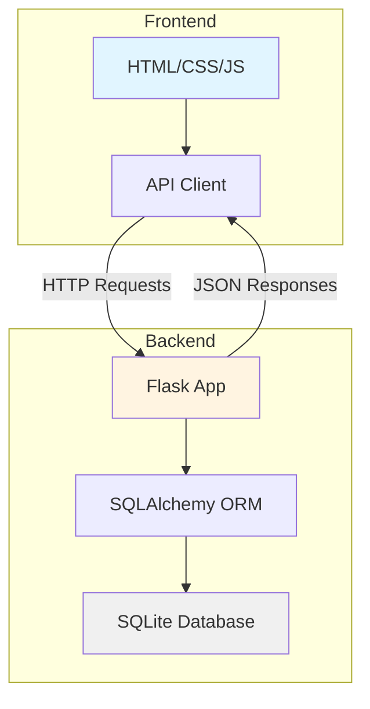
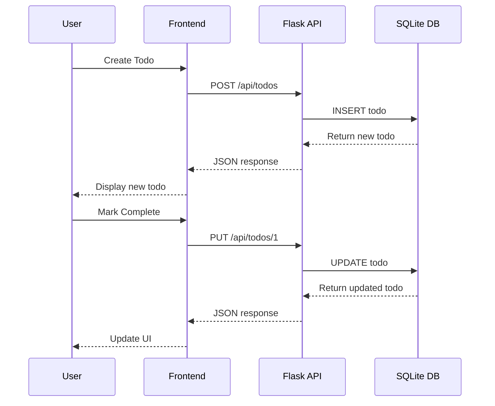

# Todo Application - Technical Plan

## Overview
A basic todo application with Flask backend and vanilla JavaScript frontend, using SQLite for data persistence. Single-user CRUD operations for managing todo items.

---

## 1. Project Directory Structure

```
todo-app/
├── backend/
│   ├── app.py                 # Main Flask application
│   ├── models.py              # Database models
│   ├── config.py              # Configuration settings
│   ├── requirements.txt       # Python dependencies
│   ├── database.db            # SQLite database (auto-generated)
│   └── tests/
│       └── test_api.py        # API tests
├── frontend/
│   ├── index.html             # Main HTML page
│   ├── css/
│   │   └── styles.css         # Application styles
│   ├── js/
│   │   ├── app.js             # Main application logic
│   │   └── api.js             # API communication layer
│   └── assets/
│       └── favicon.ico        # Application icon
├── .gitignore                 # Git ignore file
└── README.md                  # Project documentation
```

---

## 2. API Endpoints

### Base URL: `http://localhost:5000/api`

| Method | Endpoint | Description | Request Body | Response |
|--------|----------|-------------|--------------|----------|
| GET | `/todos` | Get all todos | None | `[{id, title, description, completed, created_at, updated_at}]` |
| GET | `/todos/<id>` | Get single todo | None | `{id, title, description, completed, created_at, updated_at}` |
| POST | `/todos` | Create new todo | `{title, description?}` | `{id, title, description, completed, created_at, updated_at}` |
| PUT | `/todos/<id>` | Update todo | `{title?, description?, completed?}` | `{id, title, description, completed, created_at, updated_at}` |
| DELETE | `/todos/<id>` | Delete todo | None | `{message: "Todo deleted"}` |

### API Response Format

**Success Response:**
```json
{
  "success": true,
  "data": { ... }
}
```

**Error Response:**
```json
{
  "success": false,
  "error": "Error message"
}
```

### Example API Calls

**Create Todo:**
```json
POST /api/todos
{
  "title": "Buy groceries",
  "description": "Milk, eggs, bread"
}
```

**Update Todo:**
```json
PUT /api/todos/1
{
  "completed": true
}
```

---

## 3. Database Schema

### Table: `todos`

| Column | Type | Constraints | Description |
|--------|------|-------------|-------------|
| id | INTEGER | PRIMARY KEY, AUTOINCREMENT | Unique identifier |
| title | TEXT | NOT NULL | Todo title (required) |
| description | TEXT | NULL | Optional description |
| completed | BOOLEAN | DEFAULT FALSE | Completion status |
| created_at | TIMESTAMP | DEFAULT CURRENT_TIMESTAMP | Creation timestamp |
| updated_at | TIMESTAMP | DEFAULT CURRENT_TIMESTAMP | Last update timestamp |

### SQL Schema:
```sql
CREATE TABLE todos (
    id INTEGER PRIMARY KEY AUTOINCREMENT,
    title TEXT NOT NULL,
    description TEXT,
    completed BOOLEAN DEFAULT 0,
    created_at TIMESTAMP DEFAULT CURRENT_TIMESTAMP,
    updated_at TIMESTAMP DEFAULT CURRENT_TIMESTAMP
);

-- Trigger to auto-update updated_at
CREATE TRIGGER update_todos_timestamp 
AFTER UPDATE ON todos
BEGIN
    UPDATE todos SET updated_at = CURRENT_TIMESTAMP WHERE id = NEW.id;
END;
```

---

## 4. Technology Stack

### Backend
- **Framework:** Flask 3.0+
- **Database ORM:** SQLAlchemy 2.0+
- **Database:** SQLite 3
- **CORS:** Flask-CORS (for cross-origin requests)
- **Validation:** Marshmallow (optional, for request validation)
- **Testing:** pytest

### Frontend
- **Core:** Vanilla JavaScript (ES6+)
- **Styling:** CSS3 with Flexbox/Grid
- **HTTP Client:** Fetch API
- **No frameworks** - keeping it simple and lightweight

### Development Tools
- **Python Version:** 3.8+
- **Package Manager:** pip
- **Version Control:** Git
- **Code Editor:** VS Code (recommended)

### Python Dependencies (`requirements.txt`):
```
Flask==3.0.0
Flask-CORS==4.0.0
SQLAlchemy==2.0.23
pytest==7.4.3
```

---

## 5. Implementation Plan

### Phase 1: Backend Setup
1. Create project directory structure
2. Set up Python virtual environment
3. Install dependencies from [`requirements.txt`](backend/requirements.txt)
4. Create database models in [`models.py`](backend/models.py)
5. Implement Flask application in [`app.py`](backend/app.py)
6. Create API endpoints with proper error handling
7. Test API endpoints using pytest or Postman

### Phase 2: Frontend Development
1. Create HTML structure in [`index.html`](frontend/index.html)
2. Design CSS styles in [`styles.css`](frontend/css/styles.css)
3. Implement API communication layer in [`api.js`](frontend/js/api.js)
4. Build main application logic in [`app.js`](frontend/js/app.js)
5. Add event listeners and DOM manipulation
6. Implement CRUD operations in the UI

### Phase 3: Integration & Testing
1. Connect frontend to backend API
2. Test all CRUD operations end-to-end
3. Handle error cases and edge conditions
4. Add loading states and user feedback
5. Test cross-browser compatibility

### Phase 4: Polish & Documentation
1. Add input validation on both frontend and backend
2. Improve UI/UX with animations and transitions
3. Write comprehensive README with setup instructions
4. Add code comments and documentation
5. Create `.gitignore` file

---

## 6. Setup Instructions

### Backend Setup:
```bash
# Navigate to backend directory
cd backend

# Create virtual environment
python -m venv venv

# Activate virtual environment
# On macOS/Linux:
source venv/bin/activate
# On Windows:
venv\Scripts\activate

# Install dependencies
pip install -r requirements.txt

# Run the application
python app.py
```

### Frontend Setup:
```bash
# Simply open index.html in a browser
# Or use a local server (recommended):
cd frontend
python -m http.server 8000
# Then visit http://localhost:8000
```

---

## 7. Key Features to Implement

### Backend Features:
- ✓ RESTful API design
- ✓ CORS enabled for frontend communication
- ✓ Input validation and error handling
- ✓ Automatic timestamp management
- ✓ SQLite database with SQLAlchemy ORM
- ✓ Proper HTTP status codes

### Frontend Features:
- ✓ Display all todos in a list
- ✓ Add new todo with title and description
- ✓ Mark todo as complete/incomplete
- ✓ Edit existing todo
- ✓ Delete todo with confirmation
- ✓ Filter todos (all/active/completed)
- ✓ Responsive design for mobile devices
- ✓ Loading states and error messages

---

## 8. Architecture Diagram



---

## 9. API Flow Diagram



---

## 10. Security Considerations

For this basic single-user application:
- Input validation on both frontend and backend
- SQL injection prevention (SQLAlchemy handles this)
- CORS configuration for allowed origins
- Error messages that don't expose sensitive information

**Note:** For production multi-user applications, you would need:
- User authentication (JWT tokens)
- Authorization checks
- Rate limiting
- HTTPS encryption
- Environment variables for sensitive data

---

## 11. Future Enhancements (Optional)

- Add user authentication
- Implement todo categories/tags
- Add due dates and reminders
- Enable todo prioritization
- Add search and filter functionality
- Implement data export (JSON/CSV)
- Add dark mode toggle
- Enable drag-and-drop reordering
- Add todo statistics dashboard

---

## 12. Estimated Development Time

- Backend setup and API: 2-3 hours
- Frontend development: 3-4 hours
- Integration and testing: 1-2 hours
- Documentation and polish: 1 hour

**Total: 7-10 hours** for a complete, polished application

---

## Next Steps

1. Review this plan and confirm it meets your requirements
2. Switch to Code mode to begin implementation
3. Start with backend setup (Phase 1)
4. Then move to frontend development (Phase 2)
5. Complete integration and testing (Phase 3)
6. Finalize with documentation (Phase 4)